# Disclaimer
This is my first flutter app, so it probably contains a lot of bad approach examples and therefore should not be used for learning purposes!
I do not own any images / videos / data visible in this app, they're provided by TMDB API - this app is built around it, but is not endorsed or certified by TMDB in any way.
This whole app was made for learning purposes, so please be understanding.

# watched_it_getx

Movie/Tv tracker app made with flutter using TMDB Api. Still in development.  

This product uses the TMDb API but is not endorsed or certified by TMDb.
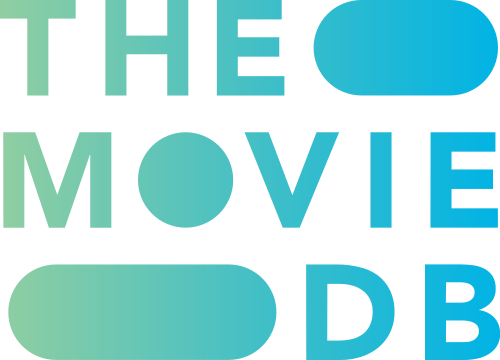

## Used packages
Get,
GetStorage,
Http,
Webview_flutter,
flutter_secure_storage,
flutter_custom_clippers,
provider,
sqflite,

## Screenshots

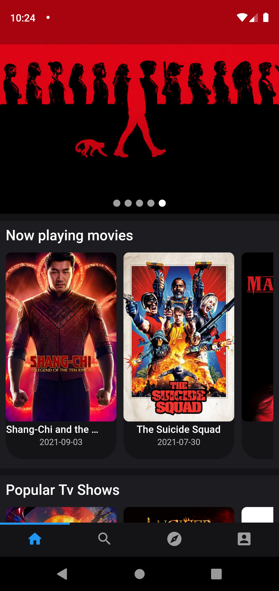
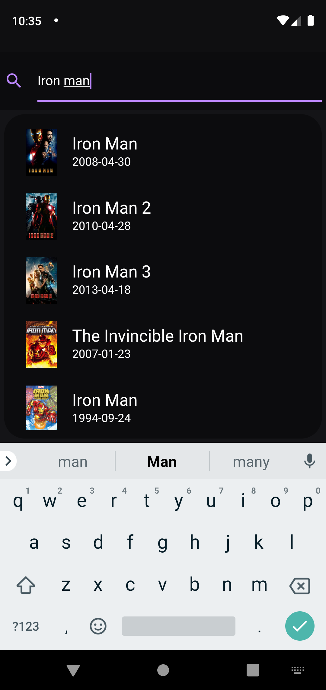
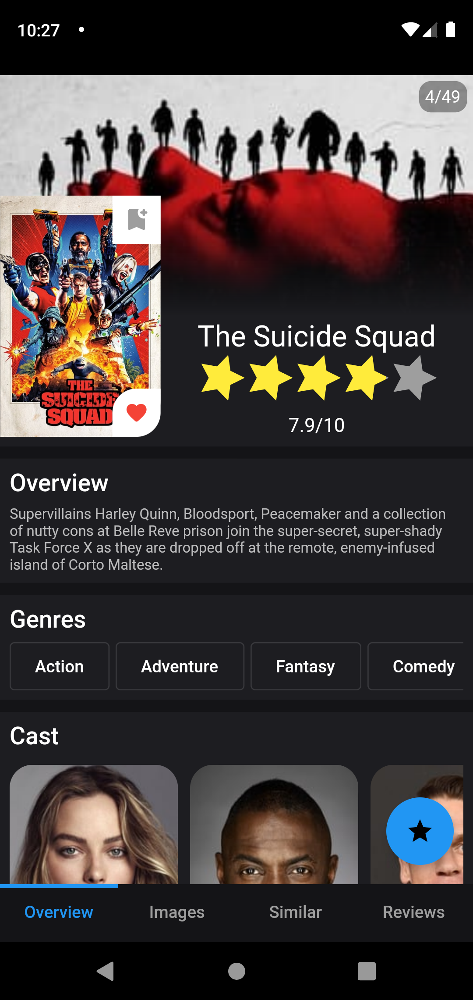
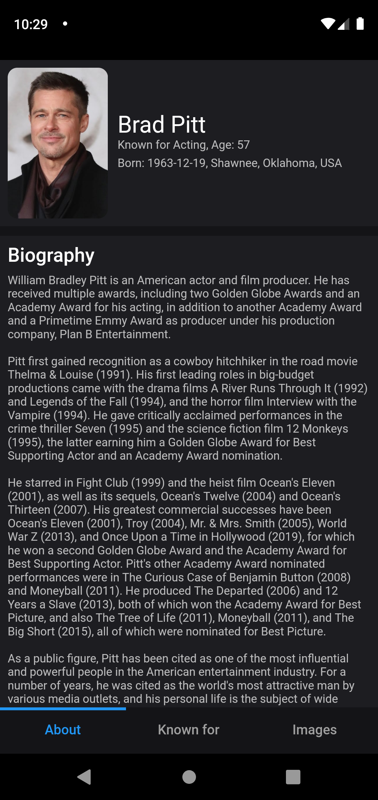
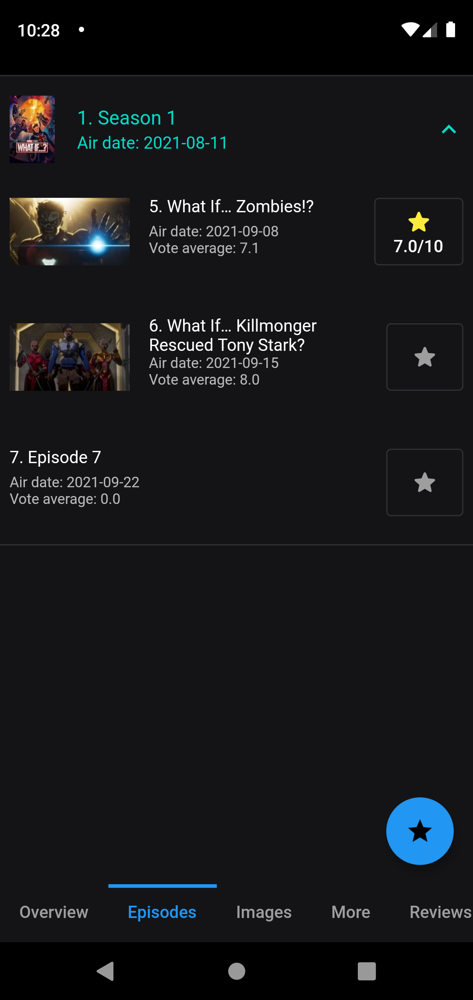
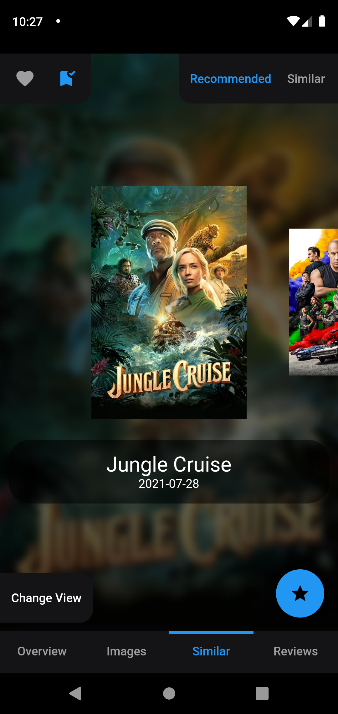
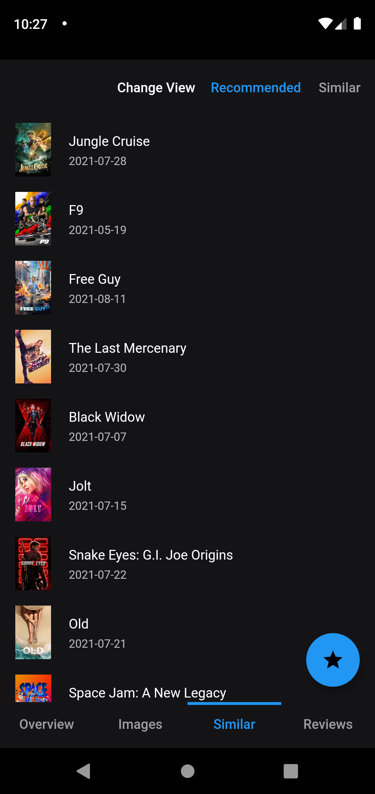
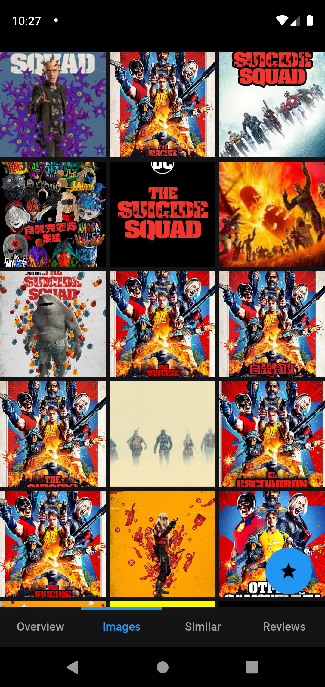
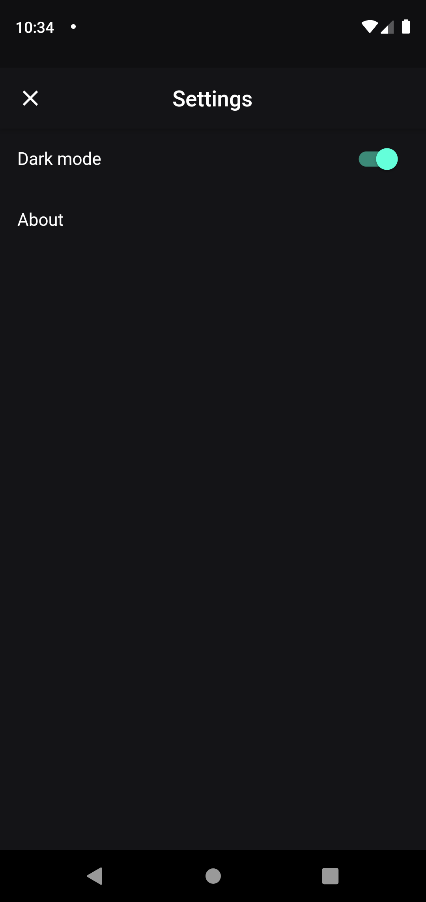
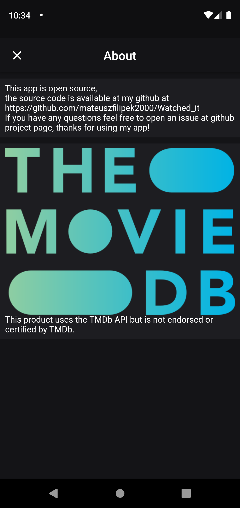

## Videos

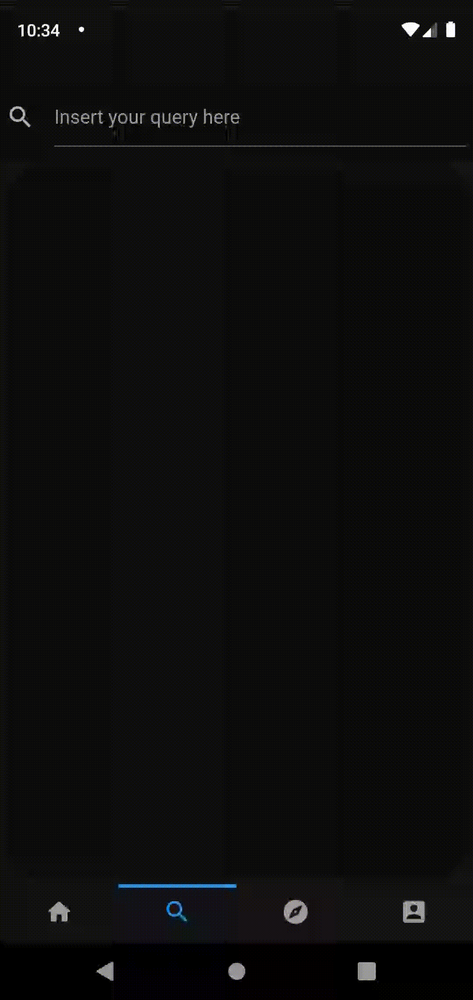

# Watched_it
